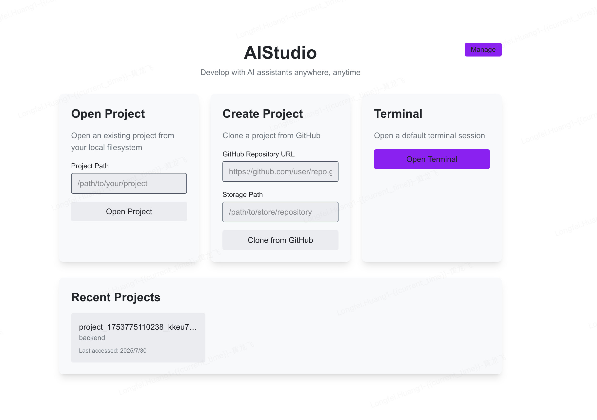
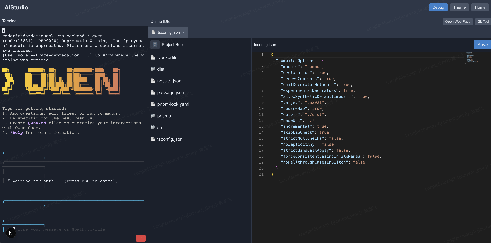
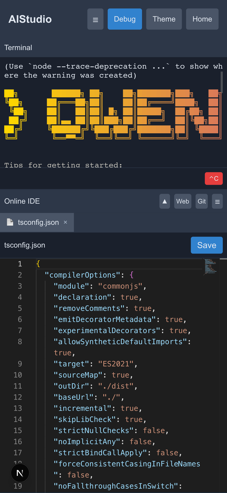

# AIWebStudio

AIWebStudio is a web-based integrated development environment that allows you to develop projects using AI assistants like Qwen and Gemini directly in your browser. It makes mobile development possible by providing a full development environment accessible from any device with a web browser.

[中文版本](README_zh.md)

## Features

- **AI Programming Assistants**: Use Qwen and Gemini directly in your browser for coding
- **Mobile Development Support**: Develop on any device through a web browser
- **Project Management**: Create new projects or open existing ones from your local filesystem
- **GitHub Integration**: Clone repositories directly from GitHub
- **Integrated Terminal**: Full-featured terminal with support for all standard commands
- **Code Editor**: Built-in code editor with syntax highlighting for multiple languages
- **File Explorer**: Browse and manage your project files
- **Web Viewer**: Preview web applications directly in the IDE
- **Git Integration**: Commit changes, view diffs, and check commit history without leaving the browser
- **Debug Configuration**: Run debug commands and preview applications on custom ports
- **Process Manager**: View and manage application processes started through the debug feature
- **Folder Selection**: Visual folder browser with intuitive navigation and selection
- **Environment Configuration**: Secure authentication with customizable admin credentials
- **Responsive Design**: Optimized for both desktop and mobile devices

## Screenshots

### Home Page


### PC Terminal Page


### Mobile Terminal Page


AIWebStudio features full responsive design, providing an optimized experience on both desktop and mobile devices.

## Technologies Used

- [Next.js 15](https://nextjs.org/) - React framework for production
- [TypeScript](https://www.typescriptlang.org/) - Typed JavaScript
- [Socket.IO](https://socket.io/) - Real-time communication between client and server
- [xterm.js](https://xtermjs.org/) - Terminal front-end component
- [Monaco Editor](https://microsoft.github.io/monaco-editor/) - Code editor engine
- [Tailwind CSS](https://tailwindcss.com/) - Utility-first CSS framework

## Getting Started

First, install the dependencies:

```bash
npm install
```

### Environment Configuration

The application uses environment variables for authentication configuration. Copy the example file to create your local configuration:

```bash
cp .env.example .env.local
```

Edit `.env.local` to customize your admin credentials:

```bash
# Default admin user credentials
DEFAULT_ADMIN_USERNAME=your_admin_username
DEFAULT_ADMIN_PASSWORD=your_secure_password
DEFAULT_ADMIN_EMAIL=your_email@example.com

# JWT Configuration
JWT_SECRET=your-secret-key-change-in-production
JWT_EXPIRES_IN=24h
```

Then, run the development server:

```bash
# Start the backend server (includes terminal functionality)
npm run server

# Or in another terminal window, start the frontend development server
npm run dev
```

Open [http://localhost:3010](http://localhost:3010) with your browser to see the application. (The backend server runs on port 3010 by default)

Note: `npm run dev` only starts the frontend service, while `npm run server` starts the complete backend service with terminal functionality.

### Default Login

The application creates a default admin user automatically. You can customize these credentials in your `.env.local` file:

- **Default Username**: `admin`
- **Default Password**: `admin123`
- **Default Email**: `admin@example.com`

## Available Scripts

- `npm run dev` - Runs the frontend app in development mode
- `npm run build` - Builds the app for production
- `npm run start` - Runs the built app in production mode
- `npm run lint` - Runs ESLint to check for code issues
- `npm run server` - Starts the backend server with terminal support
- `npm run deploy` - Builds the app and starts the production server
- `npm run pm2:start` - Starts the application using PM2 with ecosystem config
- `npm run pm2:stop` - Stops the PM2 managed application
- `npm run pm2:restart` - Restarts the PM2 managed application
- `npm run pm2:delete` - Removes the application from PM2
- `npm run pm2:logs` - Shows logs for the PM2 managed application

## Deployment

To deploy AIWebStudio to a cloud server, follow these steps:

1. Choose a cloud server that supports Node.js (such as AWS EC2, Google Cloud, Alibaba Cloud, etc.)

2. Install Node.js environment on the server:
   ```bash
   # Ubuntu/Debian example
   curl -fsSL https://deb.nodesource.com/setup_20.x | sudo -E bash -
   sudo apt-get install -y nodejs
   
   # Or use nvm to install and manage Node.js versions
   curl -o- https://raw.githubusercontent.com/nvm-sh/nvm/v0.39.0/install.sh | bash
   nvm install 20
   ```

3. Clone the project to the server:
   ```bash
   git clone https://github.com/hfstack/ai-web-studio.git
   cd ai-web-studio
   ```

4. Install project dependencies:
   ```bash
   npm install
   ```

5. Install AI tools:
   ```bash
   # Install Qwen Code
   npm install -g @qwen-code/qwen-code
   
   # Install Gemini CLI
   npm install -g @google/gemini-cli
   ```

6. Configure environment variables:
   Create a `.env.local` file and add the necessary API keys:
   ```bash
   # Default admin user credentials
   DEFAULT_ADMIN_USERNAME=your_admin_username
   DEFAULT_ADMIN_PASSWORD=your_secure_password
   DEFAULT_ADMIN_EMAIL=your_email@example.com

   # JWT Configuration
   JWT_SECRET=your-secret-key-change-in-production
   JWT_EXPIRES_IN=24h

   # Qwen API configuration
   OPENAI_API_KEY="your_qwen_api_key_here"
   OPENAI_BASE_URL="https://dashscope.aliyuncs.com/compatible-mode/v1"
   OPENAI_MODEL="qwen3-coder-plus"
   
   # If using Gemini, configure the appropriate API key
   GOOGLE_API_KEY="your_google_api_key_here"
   ```

7. Build the project:
   ```bash
   npm run build
   ```

8. Start the service:
   ```bash
   npm run server
   ```

9. (Optional) Use PM2 or another process manager to keep the service running:
   ```bash
   # Install PM2
   npm install -g pm2
   
   # Use PM2 to start the service with ecosystem config
   npm run pm2:start
   
   # Or use PM2 directly with the configuration file
   pm2 start ecosystem.config.js
   
   # Set up auto-start on boot
   pm2 startup
   
   # Save the current process list
   pm2 save
   ```

10. Configure firewall and reverse proxy (such as Nginx) to allow external access.

AIWebStudio should now be running on your cloud server. Make sure you have properly configured API keys for all AI tools to be able to use Qwen and Gemini features.

## Project Structure

```
├── src/
│   ├── app/              # Next.js app router pages
│   │   ├── api/          # API routes
│   │   ├── terminal/     # Terminal page with components
│   │   └── ...           # Other pages
│   └── lib/              # Shared libraries and utilities
├── public/               # Static assets
└── server.ts             # Main server entry point
```

## How to Use

### 1. Authentication
- Login using the default admin credentials or your custom credentials from `.env.local`
- The application uses JWT tokens for authentication with secure session management

### 2. Home Page
- **Open Project**: Browse and select an existing project folder using the folder selector
- **Create Project**: Clone a GitHub repository by providing the repository URL and storage path
- **Terminal**: Open a default terminal session for system-level operations

### 3. Folder Selection
- Click the 📁 icon to open the folder browser
- Navigate through directories using the file explorer interface
- Select folders by clicking "Select Current Folder" or double-clicking to navigate

### 4. Terminal
- The terminal provides a full-featured command line interface
- You can run any command that would normally work in your system terminal
- Real-time output display with proper ANSI color support

### 5. File Management
- Use the file explorer to navigate your project files
- Double-click on any file to open it in the code editor
- Create, rename, and delete files and folders

### 6. Code Editing
- The built-in code editor supports multiple programming languages with syntax highlighting
- Features include code completion, error highlighting, and multi-cursor editing
- Auto-save functionality to prevent data loss

### 7. Git Integration
- Use the Git tool to stage, commit, and view your changes
- See commit history and file diffs
- Push and pull operations with remote repositories

### 8. Web Viewer
- Preview web applications by entering a URL
- Use the debug feature to run and preview applications on custom ports
- Integrated browser for testing web applications

## AI Tools Usage

### Qwen Code (qwen)

Qwen Code is a CLI tool modified from Gemini CLI, with enhanced parser and tool support for the Qwen3-Coder series models.

Make sure you have Node.js 20 or above installed, you can install it with:

```bash
curl -qL https://www.npmjs.com/install.sh | sh
```

Then install Qwen Code via npm:

```bash
npm i -g @qwen-code/qwen-code
```

Alternatively, you can install from source:

```bash
git clone https://github.com/QwenLM/qwen-code.git
cd qwen-code && npm install && npm install -g
```

Qwen Code supports OpenAI SDK to call LLMs. You can export the following environment variables, or simply put them in a `.env` file:

```bash
```bash
export OPENAI_API_KEY="ms-xxx"
export OPENAI_BASE_URL="https://api-inference.modelscope.cn/v1/"
export OPENAI_MODEL="Qwen/Qwen3-Coder-480B-A35B-Instruct"
```

#### Qwen Code Free Usage Tips

If you can't afford the official Qwen3-Code credit interface, check out the ModelScope community. It gives you 2,000 free API calls per day, and you can not only use Qwen3-Code but also try other models - it's a great deal!

Visit: [ModelScope Community](https://modelscope.cn/models?qwen3)

### Gemini CLI (gemini-cli)

Gemini CLI is a command-line tool written in TypeScript that runs on all platforms, including Windows, macOS, and Linux.

#### Installation

Choose global installation so you can directly use the gemini command anywhere:

```bash
npm install -g @google/gemini-cli
```

Installation requirements: Node.js version 18 or higher.

#### Upgrading

gemini-cli updates frequently, and you can upgrade based on the update prompts after logging in:

```bash
npm install -g @google/gemini-cli
```

If you encounter permission issues, prepend the command with sudo.

#### Running and Logging In

Run the `gemini` command to see the gemini-cli welcome interface.

When you first run it, it will prompt you to select a preferred theme color, which can later be modified using the `/theme` command.

Important reminder: Since the first login requires Google account authentication, you must run the `gemini` command in a desktop terminal, otherwise login will continuously fail. Currently, gemini doesn't provide clear prompts, just a link.

Select the login method, here we choose to log in with Google account:

```
Select Auth Method
│ ● Login with Google
│ ○ Gemini API Key
│ ○ Vertex AI
```

After running the login command, it will automatically open a browser and redirect to the login page. Log in with your Google account.

If you're logging in via SSH, you'll receive a timeout prompt: "Authentication timed out. Please try again.", along with a URL. This is because the login flow cannot be completed without a desktop environment.

Reiterating: You must run the gemini command in a desktop terminal, otherwise login will continuously fail.

If login fails with the message: "Login Failed: Ensure your Google account is not a Workspace account", it's because your Google account is bound to Google Cloud, causing it to be misidentified as a Workspace account.

There are two solutions:
1. Switch to an account not bound to Google Cloud
2. Visit https://console.cloud.google.com to check your project number

#### Basic Usage

```bash
# Basic usage
gemini "Please help me write a function to calculate the Fibonacci sequence"

# Read prompt from file
gemini --file prompt.txt

# Specify model parameters
gemini --model gemini-pro "Help me explain what this code does"

# Save output to file
gemini "Generate a React component example" --output component.js
```

## Deployment

This application can be deployed to any platform that supports Node.js applications. You'll need to ensure that the deployment environment has Git installed for the Git integration features to work properly.

For Vercel deployments, you may need to customize the build settings to accommodate the custom server implementation.
