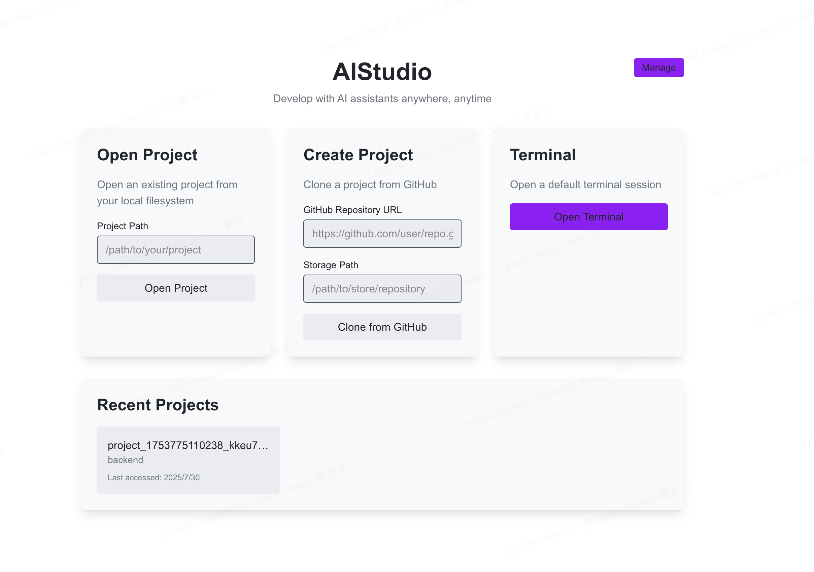
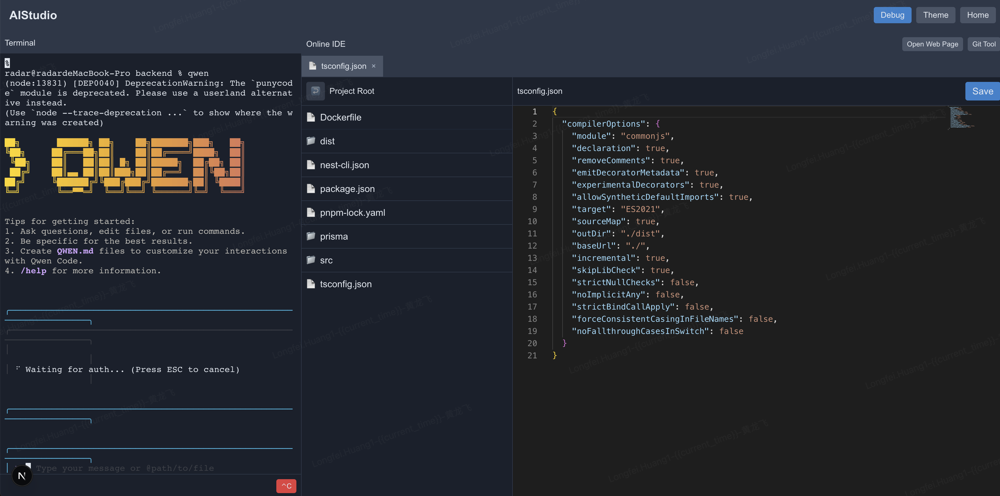
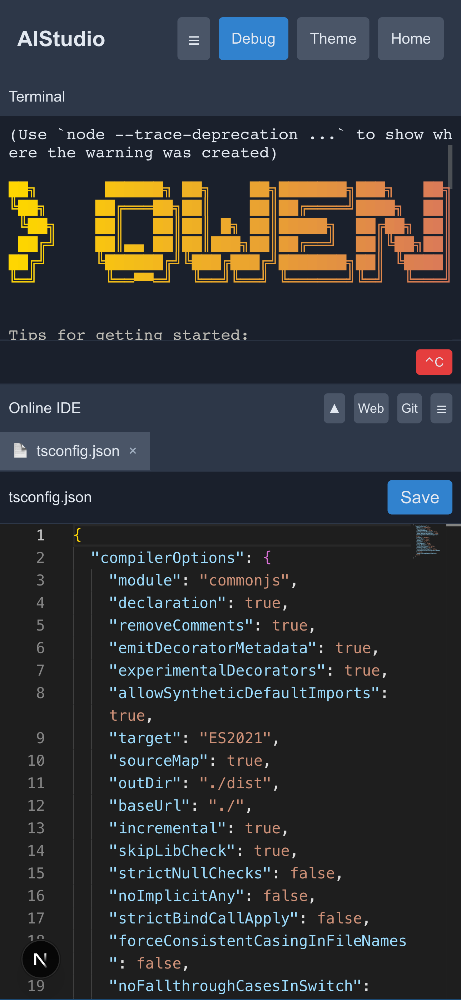

# AIStudio

AIStudio 是一个基于 Web 的集成开发环境，允许您在浏览器中直接使用 Qwen 和 Gemini 等 AI 助手来开发项目。它通过提供一个可通过任何设备的网页浏览器访问的完整开发环境，使移动开发成为可能。

## 功能特性

- **AI 编程助手**：在浏览器中直接使用 Qwen 或 Gemini 进行编程
- **移动开发支持**：通过网页浏览器在任何设备上进行开发
- **项目管理**：创建新项目或从本地文件系统打开现有项目
- **GitHub 集成**：直接从 GitHub 克隆仓库
- **集成终端**：全功能终端，支持所有标准命令
- **代码编辑器**：内置代码编辑器，支持多种语言的语法高亮
- **文件浏览器**：浏览和管理项目文件
- **网页查看器**：直接在 IDE 中预览网页应用
- **Git 集成**：在不离开浏览器的情况下提交更改、查看差异和检查提交历史
- **调试配置**：运行调试命令并在自定义端口上预览应用程序
- **进程管理器**：查看和管理通过调试功能启动的应用进程

## 界面截图

### 首页


### PC 端终端页面


### 移动端终端页面


AIStudio 采用全响应式设计，在桌面和移动设备上都提供优化的体验。

## 使用技术

- [Next.js 15](https://nextjs.org/) - 用于生产的 React 框架
- [TypeScript](https://www.typescriptlang.org/) - 类型化 JavaScript
- [Socket.IO](https://socket.io/) - 客户端和服务器之间的实时通信
- [xterm.js](https://xtermjs.org/) - 终端前端组件
- [Monaco Editor](https://microsoft.github.io/monaco-editor/) - 代码编辑器引擎
- [Tailwind CSS](https://tailwindcss.com/) - 实用优先的 CSS 框架

## 快速开始

首先，安装依赖项：

```bash
npm install
```

然后，运行开发服务器：

```bash
# 启动后端服务（包含终端功能）
npm run server

# 或者在另一个终端窗口启动前端开发服务
npm run dev
```

在浏览器中打开 [http://localhost:3010](http://localhost:3010) 查看应用程序。（后端服务默认运行在 3010 端口）

注意：`npm run dev` 只启动前端服务，而 `npm run server` 启动包含终端功能的完整后端服务。

## 可用脚本

- `npm run dev` - 在开发模式下运行前端应用程序
- `npm run build` - 构建用于生产环境的应用程序
- `npm run start` - 在生产模式下运行构建的应用程序
- `npm run lint` - 运行 ESLint 检查代码问题
- `npm run server` - 启动带终端支持的后端服务器

## 部署

要将 AIStudio 部署到云端服务器，请按照以下步骤操作：

1. 选择一个支持 Node.js 的云服务器（如 AWS EC2、Google Cloud、阿里云等）

2. 在服务器上安装 Node.js 环境：
   ```bash
   # Ubuntu/Debian 示例
   curl -fsSL https://deb.nodesource.com/setup_20.x | sudo -E bash -
   sudo apt-get install -y nodejs
   
   # 或者使用 nvm 安装和管理 Node.js 版本
   curl -o- https://raw.githubusercontent.com/nvm-sh/nvm/v0.39.0/install.sh | bash
   nvm install 20
   ```

3. 克隆项目到服务器：
   ```bash
   git clone <your-repo-url>
   cd aistudio
   ```

4. 安装项目依赖：
   ```bash
   npm install
   ```

5. 安装 AI 工具：
   ```bash
   # 安装 Qwen Code
   npm install -g @qwen-code/qwen-code
   
   # 安装 Gemini CLI
   npm install -g @google/gemini-cli
   ```

6. 配置环境变量：
   创建 `.env` 文件并添加必要的 API 密钥：
   ```bash
   # Qwen API 配置
   export OPENAI_API_KEY="your_qwen_api_key_here"
   export OPENAI_BASE_URL="https://dashscope.aliyuncs.com/compatible-mode/v1"
   export OPENAI_MODEL="qwen3-coder-plus"
   
   # 如果使用 Gemini，配置相应的 API 密钥
   export GOOGLE_API_KEY="your_google_api_key_here"
   ```

7. 构建项目：
   ```bash
   npm run build
   ```

8. 启动服务：
   ```bash
   npm run server
   ```

9. （可选）使用 PM2 或其他进程管理工具来保持服务运行：
   ```bash
   # 安装 PM2
   npm install -g pm2
   
   # 使用 PM2 启动服务
   pm2 start server.ts --name aistudio
   pm2 startup  # 设置开机自启
   pm2 save     # 保存当前进程列表
   ```

10. 配置防火墙和反向代理（如 Nginx）以允许外部访问。

现在，AIStudio 应该在你的云服务器上运行了。确保你已正确配置了所有 AI 工具的 API 密钥，以便能够正常使用 Qwen 和 Gemini 功能。

## 项目结构

```
├── src/
│   ├── app/              # Next.js 应用路由页面
│   │   ├── api/          # API 路由
│   │   ├── terminal/     # 带组件的终端页面
│   │   └── ...           # 其他页面
│   └── lib/              # 共享库和工具
├── public/               # 静态资源
└── server.ts             # 主服务器入口点
```

## 使用方法

1. **主页**：首先打开现有项目、克隆 GitHub 仓库或打开默认终端。

2. **终端**：终端提供全功能的命令行界面。您可以运行任何在系统终端中正常工作的命令。

3. **文件管理**：使用文件浏览器导航项目文件。双击任何文件以在代码编辑器中打开它。

4. **代码编辑**：内置代码编辑器支持多种编程语言并具有语法高亮功能。

5. **Git 集成**：使用 Git 工具暂存、提交和查看更改。您还可以查看提交历史和文件差异。

6. **网页查看器**：通过输入 URL 或使用调试功能在自定义端口上运行和预览网页应用程序。

## AI 工具使用

### Qwen Code (qwen)

Qwen Code 是一个 CLI 工具，修改自 Gemini CLI，针对 Qwen3-Coder 系列的模型增强了解析器和工具支持。

确保已安装 Node.js 20 及以上版本，可以通过以下命令安装：

```bash
curl -qL https://www.npmjs.com/install.sh | sh
```

然后通过 npm 管理器安装 Qwen Code：

```bash
npm i -g @qwen-code/qwen-code
```

另一种方式是从源码安装：

```bash
git clone https://github.com/QwenLM/qwen-code.git
cd qwen-code && npm install && npm install -g
```

Qwen Code 支持 OpenAI SDK 调用 LLM，你可以导出以下环境变量，或者简单地将其放在 `.env` 文件中：

```bash
# API 密钥
export OPENAI_API_KEY="ms-xxx"
# API 基础 URL
export OPENAI_BASE_URL="https://api-inference.modelscope.cn/v1/"
# 模型名称
export OPENAI_MODEL="Qwen/Qwen3-Coder-480B-A35B-Instruct"
```


#### qwencode 白嫖攻略

如果你也用不起 Qwen3-Code 的官方积分接口，不妨来魔塔社区看看。它每天直接白送你 2,000 次免费调用额度，不仅可以用 Qwen3-Code，其他模型也都能试用，简直太香了！

访问地址：[魔塔社区](https://modelscope.cn/models?qwen3)

### Gemini CLI (gemini-cli)

Gemini CLI 是一个使用 TypeScript 编写的命令行工具，可在所有平台上运行，包括 Windows、macOS 和 Linux。

#### 安装

选择全局安装，以便在任何地方都能直接使用 gemini 命令：

```bash
npm install -g @google/gemini-cli
```

安装环境要求：Node.js 版本 18 或更高版本。

#### 升级

gemini-cli 更新很快，可以根据登录后的更新提示进行升级：

```bash
npm install -g @google/gemini-cli
```

如遇到权限问题，请加入 sudo 命令。

#### 运行与登录

运行 `gemini` 命令，就可以看到 gemini-cli 的欢迎界面。

首次运行时，它会提示你选择一个喜欢的主题颜色，这个主题颜色后续还可以通过 `/theme` 令进行修改。

特别提醒，由于首次登录要进行谷歌账号登录，一定要在有桌面的命令行中启动 `gemini` 命令，否则会一直登录失败。目前 gemini 没有明确的提示，只是给了你一个链接。

选择登录方式，这里我们选择使用谷歌账号登录：

```
Select Auth Method
│ ● Login with Google
│ ○ Gemini API Key
│ ○ Vertex AI
```

运行登录命令后，会自动打开浏览器，跳转到登录页面，使用谷歌账号登录即可。

如果通过 SSH 方式登录，会收到超时提示："Authentication timed out. Please try again."，然后给出一个网址。这是因为没有桌面环境无法完成登录流程。

再次重申：一定要在桌面终端中运行 gemini 命令，否则会一直登录失败。

如果登录失败，提示："Login Failed: Ensure your Google account is not a Workspace account"，这是因为你的 Google 账号绑定了 Google Cloud，导致被误判成了 Workspace 账号。

有两种解决方案：
1. 更换未绑定 Google Cloud 的账号
2. 访问 https://console.cloud.google.com 查看你的项目编号

#### 基本使用

```bash
# 基本用法
gemini "请帮我写一个计算斐波那契数列的函数"

# 从文件读取提示
gemini --file prompt.txt

# 指定模型参数
gemini --model gemini-pro "帮我解释这段代码的作用"

# 保存输出到文件
gemini "生成一个 React 组件示例" --output component.js
```

## 部署

此应用程序可以部署到任何支持 Node.js 应用程序的平台。您需要确保部署环境安装了 Git，以便 Git 集成功能正常工作。

对于 Vercel 部署，您可能需要自定义构建设置以适应自定义服务器实现。

---

[English Version](README.md) | [返回顶部](#aistudio)